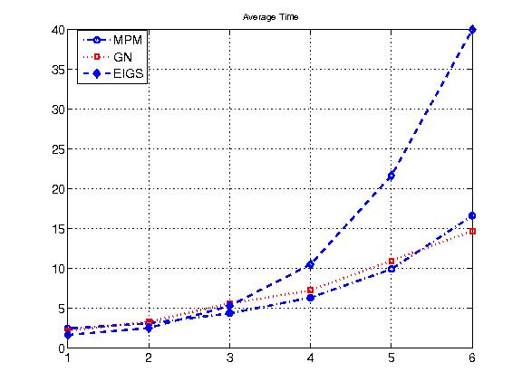

# Arrabit
**A**ugmented **R**ayleigh-**R**itz (ARR) And **B**lock **It**eration for large-cale eigenpair computation

## Introduction 
**Arrabit** is a MATLAB solver for computing many eigenpairs of large-scale 
sparse (or structured) matrices.  In general, the dominant computational 
cost in Arrabit is the matrix multiplications (A*X). 

Iterations in Arrabit consist of two major steps:
- a multi-power method (MPM) or a Gauss-Newton (GN) step that generates 
  bases for approximate eigenspaces
- an ARR projection step that extracts approximate eigenpairs. 

Arrabit also makes use of a set of polynomial accelerators, as well as other 
techniques such as continuation and deflation.

## Authors  
- [Zaiwen Wen](http://bicmr.pku.edu.cn/~wenzw/index.html), Peking University
- [Yin Zhang](http://www.caam.rice.edu/~zhang), Rice University

## Publication 
 - Zaiwen Wen and Yin Zhang, Block algorithms with augmented Rayleigh-Ritz projections for large-scale eigenpair computation, [Arxiv:1507.06078](http://arxiv.org/abs/1507.06078) (This manuscript is split into a theoretical part and a numerical part due to requests from referees) 
 - Wen Zaiwen, Zhang Yin; Accelerating Convergence by Augmented Rayleigh-Ritz Projections For Large-Scale Eigenpair Computation; SIAM Journal on Matrix Analysis and Applications; Vol 38, No. 2 (2017), pp. 273-296
 - Liu Haoyang, Wen Zaiwen, Yang Chao, Zhang Yin, Block algorithms with augmented Rayleigh-Ritz projections for large-scale eigenpair computation, Journal of Computational Mathematics, Vol. 37, No. 6, pp 889-915, 2019

In the case that Arrabit is helpful in your published work, please make a reference to the above papers.

### Related Publication
- Liu Xin, Wen Zaiwen, Zhang Yin; An Efficient Gauss-Newton Algorithm for Symmetric Low-Rank Product Matrix Approximations; SIAM Journal on Optimization; Vol. 25, No. 3 (2015), 1571–1608
- Wen Zaiwen, Yang Chao, Liu Xin, Zhang Yin; Trace-Penalty Minimization for Large-scale Eigenspace Computation; Journal of Scientfic Computing; Vol. 66, No. 3(2016), pp 1175-1203
- Liu Xin, Wen Zaiwen, Zhang Yin; Limited Memory Block Krylov Subspace Optimization for Computing Dominant Singular Value Decompositions; SIAM Journal on Scientific Computing; 35 (2013) A1641–A1668, [code: "LMSVD"](http://lsec.cc.ac.cn/~liuxin/lmsvd.html)

## Installation
- Download arrabit. This should create a directory arrabit_beta1.  You may move this directory to a desired location of your 
choice.  We refer to this directory as <arrabit-root>.

- Start MATLAB and add <arrabit-root/src> to your path by the command:
~~~
>> addpath <arrabit-root/src>
~~~

- To verify the Arrabit installation, go to <arrabit-root/examples> 
and execute the following command:
~~~
>> demo_eig
~~~
  
## A Typical Demo Result from "demo_eig"

This figure is a comparison of the runtime versus the growth of the matrix dimension between two variants of Arrabit 'MPM' and 'GN' and Matlab 'eigs' in calculating a few smallest eigenvalues and their corresponding eigenvectors.

